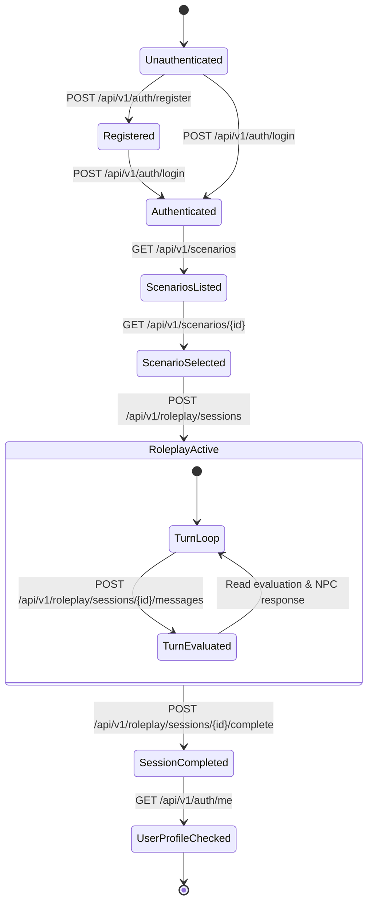

# FinLen Backend API — Complete Specification & Agent Contract

This document provides complete, machine-readable (for AI coding agents) and human-readable documentation for the **FinLen** backend API.

---

## Table of Contents
1. [General Information & Protocol](#1-general-information--protocol)
2. [AI Agent Interaction State Machine](#2-ai-agent-interaction-state-machine)
3. [Standard Error & Validation Response Formats](#3-standard-error--validation-response-formats)
4. [Endpoint Reference](#4-endpoint-reference)
   - [Auth: Register](#41-post-apiv1authregister)
   - [Auth: Login](#42-post-apiv1authlogin)
   - [Auth: Get Me](#43-get-apiv1authme)
   - [Scenarios: List Scenarios](#44-get-apiv1scenarios)
   - [Scenarios: Get Scenario Detail](#45-get-apiv1scenariosscenario_id)
   - [Roleplay: Create Session](#46-post-apiv1roleplaysessions)
   - [Roleplay: Get Session Details](#47-get-apiv1roleplaysessionssession_id)
   - [Roleplay: Send Message (Turn Evaluation)](#48-post-apiv1roleplaysessionssession_idmessages)
   - [Roleplay: Get Conversation Messages](#49-get-apiv1roleplaysessionssession_idmessages)
   - [Roleplay: Complete Session](#410-post-apiv1roleplaysessionssession_idcomplete)
   - [Analyzer: Analyze Document](#411-post-apiv1analyzerdocuments)
   - [System: Health & Status](#412-system--health-endpoints)
5. [Data Models & Schema Glossary](#5-data-models--schema-glossary)
6. [Scoring & Progression Rules](#6-scoring--progression-rules)
7. [End-to-End cURL Workflow Example](#7-end-to-end-curl-workflow-example)

---

## 1. General Information & Protocol

- **Base URL**: `http://localhost:8000` (Local) / configured host
- **API Prefix**: `/api/v1`
- **Default Media Type**: `application/json`
- **Authentication**: HTTP Bearer Header
  ```http
  Authorization: Bearer <jwt_access_token>
  ```
- **Interactive Documentation**:
  - Swagger UI: `http://localhost:8000/docs`
  - ReDoc: `http://localhost:8000/redoc`
  - OpenAPI Spec (JSON): `http://localhost:8000/openapi.json`

---

## 2. AI Agent Interaction State Machine

When an autonomous agent interacts with the FinLen API, it MUST follow this deterministic sequence:



### Invariant Rules for AI Agents:
1. **Never reuse or invent IDs**: Always use UUIDs returned by `/api/v1/scenarios` and `/api/v1/roleplay/sessions`.
2. **Never send messages to completed sessions**: Once `/complete` is called on a session ID, subsequent calls to `/messages` will return `400 Bad Request`.
3. **Session Ownership**: A session created by User A cannot be accessed or modified by User B (returns `403 Forbidden`).
4. **Token Expiration**: If an endpoint responds with `401 Unauthorized`, re-authenticate via `/api/v1/auth/login` to obtain a fresh token.

---

## 3. Standard Error & Validation Response Formats

### 3.1 Generic Error Response (`400`, `401`, `403`, `404`, `409`, `500`)
```json
{
  "detail": "Human-readable error description"
}
```

### 3.2 Pydantic Validation Error (`422 Unprocessable Entity`)
```json
{
  "detail": [
    {
      "loc": ["body", "field_name"],
      "msg": "Input should be valid...",
      "type": "string_too_short"
    }
  ]
}
```

---

## 4. Endpoint Reference

---

### 4.1 POST `/api/v1/auth/register`

Create a new user account. Passwords are securely hashed with bcrypt.

- **Authentication**: None (Public)
- **Status Code**: `201 Created`

#### Request Headers
```http
Content-Type: application/json
```

#### Request Body Schema
| Field | Type | Required | Constraints | Description |
|---|---|---|---|---|
| `username` | `string` | **Yes** | Min 3, Max 50 | Unique username |
| `email` | `string` (email) | **Yes** | Valid RFC email | Unique user email address |
| `password` | `string` | **Yes** | Min 8, Max 128 | Plaintext password |

#### Request Example
```json
{
  "username": "rayhan",
  "email": "rayhan@example.com",
  "password": "SuperSecurePassword123!"
}
```

#### Response Body Schema (`201 Created`)
| Field | Type | Description |
|---|---|---|
| `id` | `string` (UUID) | Unique user identifier |
| `username` | `string` | User's handle |
| `email` | `string` (email) | User's email |
| `level` | `integer` | Starting level (default `1`) |
| `xp` | `integer` | Starting XP (default `0`) |
| `financial_instinct` | `number` (float) | Baseline instinct score (default `0.0`) |
| `created_at` | `string` (ISO-8601) | Account creation timestamp |
| `updated_at` | `string` (ISO-8601) | Account modification timestamp |

#### Response Example
```json
{
  "id": "e7b0bc44-5cb4-4f24-916c-e588f9a9c417",
  "username": "rayhan",
  "email": "rayhan@example.com",
  "level": 1,
  "xp": 0,
  "financial_instinct": 0.0,
  "created_at": "2026-09-06T13:10:00.000Z",
  "updated_at": "2026-09-06T13:10:00.000Z"
}
```

#### Potential Error Codes
- `409 Conflict`: `{"detail": "Email already registered"}` or `{"detail": "Username already taken"}`
- `422 Unprocessable Entity`: Field validation failed (e.g. invalid email format, password too short).

---

### 4.2 POST `/api/v1/auth/login`

Authenticate credentials and receive a signed JWT access token.

- **Authentication**: None (Public)
- **Status Code**: `200 OK`

#### Request Body Schema
| Field | Type | Required | Description |
|---|---|---|---|
| `email` | `string` (email) | **Yes** | Registered email address |
| `password` | `string` | **Yes** | Plaintext password |

#### Request Example
```json
{
  "email": "rayhan@example.com",
  "password": "SuperSecurePassword123!"
}
```

#### Response Body Schema (`200 OK`)
| Field | Type | Description |
|---|---|---|
| `access_token` | `string` (JWT) | Signed JSON Web Token |
| `token_type` | `string` | Always `"bearer"` |

#### Response Example
```json
{
  "access_token": "eyJhbGciOiJIUzI1NiIsInR5cCI6IkpXVCJ9...",
  "token_type": "bearer"
}
```

#### Potential Error Codes
- `401 Unauthorized`: `{"detail": "Invalid email or password"}`

---

### 4.3 GET `/api/v1/auth/me`

Fetch current user profile and persistent financial instinct metrics.

- **Authentication**: Bearer Token required
- **Status Code**: `200 OK`

#### Request Headers
```http
Authorization: Bearer <token>
```

#### Response Body Schema (`200 OK`)
Returns `UserResponse` (same as registration response).

#### Response Example
```json
{
  "id": "e7b0bc44-5cb4-4f24-916c-e588f9a9c417",
  "username": "rayhan",
  "email": "rayhan@example.com",
  "level": 2,
  "xp": 145,
  "financial_instinct": 74.5,
  "created_at": "2026-09-06T13:10:00.000Z",
  "updated_at": "2026-09-06T13:25:00.000Z"
}
```

#### Potential Error Codes
- `401 Unauthorized`: Missing, invalid, or expired Bearer token.

---

### 4.4 GET `/api/v1/scenarios`

List all active predefined financial education scenarios.

- **Authentication**: None (Public)
- **Status Code**: `200 OK`

#### Response Body Schema (`200 OK`)
Array of `ScenarioListItem` objects:

| Field | Type | Description |
|---|---|---|
| `id` | `string` (UUID) | Unique scenario ID |
| `title` | `string` | Display title |
| `slug` | `string` | URL-safe slug |
| `description` | `string` | Scenario summary |
| `category` | `string` | E.g. `"debt"`, `"spending"`, `"fraud"`, `"emergency"` |
| `difficulty` | `string` | E.g. `"easy"`, `"medium"`, `"hard"` |
| `npc_role` | `string` | NPC persona title |
| `max_turns` | `integer` | Maximum recommended turns |

#### Response Example
```json
[
  {
    "id": "c6a51b6a-767f-4d7f-a0e2-303c74c2d58a",
    "title": "Aggressive Debt Collector",
    "slug": "aggressive-debt-collector",
    "description": "You are currently facing financial difficulties after recently losing your job...",
    "category": "debt",
    "difficulty": "medium",
    "npc_role": "Aggressive Debt Collector",
    "max_turns": 10
  }
]
```

---

### 4.5 GET `/api/v1/scenarios/{scenario_id}`

Get comprehensive scenario details, including financial numbers, constraints, and learning objectives. Internal AI system prompts are hidden.

- **Authentication**: None (Public)
- **Path Parameter**: `scenario_id` (`UUID`)
- **Status Code**: `200 OK`

#### Response Body Schema (`200 OK`)
| Field | Type | Description |
|---|---|---|
| `id` | `string` (UUID) | Unique scenario ID |
| `title` | `string` | Display title |
| `slug` | `string` | Scenario slug |
| `description` | `string` | Complete narrative background |
| `category` | `string` | Category |
| `difficulty` | `string` | Difficulty level |
| `npc_role` | `string` | NPC persona |
| `financial_context` | `object` | Authoritative financial numbers (e.g. loan amount, interest rate, savings, monthly budget) |
| `objective` | `string` | Core financial concept to master |
| `initial_state` | `object` | Starting game stats (`collector_pressure`, `financial_risk`, etc.) |
| `max_turns` | `integer` | Turn limit |
| `created_at` | `string` (ISO-8601) | Timestamp |
| `learning_materials` | `Array<LearningMaterialItem>` | Supplementary PDF materials linked to this scenario (see below) |

`LearningMaterialItem`:

| Field | Type | Description |
|---|---|---|
| `id` | `string` (UUID) | Unique learning material ID |
| `title` | `string` | Material title |
| `description` | `string` or `null` | Optional summary |
| `formal_file_url` | `string` or `null` | Public URL of the formal-version PDF, resolved from Supabase Storage using `formal_file_path` |
| `brainrot_file_url` | `string` or `null` | Public URL of the brainrot-version PDF, resolved from Supabase Storage using `brainrot_file_path` |
| `source_name` | `string` or `null` | Original source attribution |
| `source_url` | `string` or `null` | Original source link |
| `created_at` | `string` (ISO-8601) | Timestamp |

#### Response Example
```json
{
  "id": "c6a51b6a-767f-4d7f-a0e2-303c74c2d58a",
  "title": "Aggressive Debt Collector",
  "slug": "aggressive-debt-collector",
  "description": "You have an outstanding loan of Rp3,000,000 overdue for two months with 5% interest...",
  "category": "debt",
  "difficulty": "medium",
  "npc_role": "Aggressive Debt Collector",
  "financial_context": {
    "loan_amount": 3000000,
    "currency": "IDR",
    "interest_rate": 5,
    "interest_type": "monthly",
    "repayment_period_months": 12,
    "overdue_months": 2,
    "user_condition": "recently_laid_off",
    "current_savings": 500000,
    "monthly_essential_expenses": 1200000
  },
  "objective": "Recognize financial risk, avoid impulsive financial decisions, verify claims, and negotiate repayment.",
  "initial_state": {
    "collector_pressure": 7,
    "financial_risk": 6,
    "trust_level": 1,
    "negotiation_power": 4,
    "current_stage": "opening"
  },
  "max_turns": 10,
  "created_at": "2026-09-06T13:10:00.000Z",
  "learning_materials": [
    {
      "id": "8f2e6b1a-1234-4abc-9e21-9f6a4e2d1234",
      "title": "Understanding Debt Collection Rights",
      "description": "A plain-language guide to OJK debt collection regulations.",
      "formal_file_url": "https://<project-ref>.supabase.co/storage/v1/object/public/learning-materials/aggressive-debt-collector/formal.pdf",
      "brainrot_file_url": "https://<project-ref>.supabase.co/storage/v1/object/public/learning-materials/aggressive-debt-collector/brainrot.pdf",
      "source_name": "OJK",
      "source_url": "https://ojk.go.id/",
      "created_at": "2026-09-12T10:00:00.000Z"
    }
  ]
}
```

#### Potential Error Codes
- `404 Not Found`: Scenario ID does not exist or is inactive.
- `422 Unprocessable Entity`: Malformed UUID string.

---

### 4.6 POST `/api/v1/roleplay/sessions`

Start a new roleplay session. Initializes both PostgreSQL database record and Firebase Firestore document, and generates the initial NPC message.

- **Authentication**: Bearer Token required
- **Status Code**: `201 Created`

#### Request Body Schema
| Field | Type | Required | Description |
|---|---|---|---|
| `scenario_id` | `string` (UUID) | **Yes** | The scenario to start |

#### Request Example
```json
{
  "scenario_id": "c6a51b6a-767f-4d7f-a0e2-303c74c2d58a"
}
```

#### Response Body Schema (`201 Created`)
| Field | Type | Description |
|---|---|---|
| `session_id` | `string` (UUID) | Unique session ID (matches PostgreSQL ID and Firestore doc ID) |
| `scenario` | `string` | Scenario slug |
| `scenario_title` | `string` | Human-readable title |
| `status` | `string` | Always `"active"` |
| `turn_number` | `integer` | Starts at `1` |
| `initial_state` | `SessionStateData` | Starting runtime state |
| `first_npc_message` | `string` | Opening in-character dialogue from the NPC |
| `created_at` | `string` (ISO-8601) | Creation timestamp |

#### Response Example
```json
{
  "session_id": "9f2122c3-c287-43be-a764-585a065f422b",
  "scenario": "aggressive-debt-collector",
  "scenario_title": "Aggressive Debt Collector",
  "status": "active",
  "turn_number": 1,
  "initial_state": {
    "collector_pressure": 7,
    "financial_risk": 6,
    "trust_level": 1,
    "negotiation_power": 4,
    "current_stage": "opening",
    "last_decision": "session_started",
    "updated_at": null
  },
  "first_npc_message": "Halo! Ini Budi dari penagihan pelunasan kredit. Pinjaman Anda sebesar Rp3.000.000 sudah menunggak 2 bulan! Hari ini juga harus ada pembayaran, atau tim kami akan mendatangi alamat Anda!",
  "created_at": "2026-09-06T13:15:00.000Z"
}
```

---

### 4.7 GET `/api/v1/roleplay/sessions/{session_id}`

Retrieve the current state, status, and running score metrics for a session.

- **Authentication**: Bearer Token required
- **Path Parameter**: `session_id` (`UUID`)
- **Status Code**: `200 OK`

#### Response Body Schema (`200 OK`)
| Field | Type | Description |
|---|---|---|
| `session_id` | `string` (UUID) | Session identifier |
| `scenario` | `string` | Scenario slug |
| `scenario_title` | `string` | Title |
| `status` | `string` | `"active"` or `"completed"` |
| `turn_number` | `integer` | Current turn count |
| `scores` | `SessionScores` | Running performance scores (`0..100`) |
| `current_state` | `SessionStateData` | Runtime state from Firestore |
| `xp_earned` | `integer` | Accumulated XP in this session |
| `created_at` | `string` (ISO-8601) | Session start time |
| `completed_at` | `string` (ISO-8601) or `null` | Completion time if finalized |

#### Response Example
```json
{
  "session_id": "9f2122c3-c287-43be-a764-585a065f422b",
  "scenario": "aggressive-debt-collector",
  "scenario_title": "Aggressive Debt Collector",
  "status": "active",
  "turn_number": 2,
  "scores": {
    "critical_thinking": 56,
    "risk_awareness": 58,
    "impulse_control": 54,
    "decision_making": 56,
    "financial_instinct": 56
  },
  "current_state": {
    "collector_pressure": 6,
    "financial_risk": 4,
    "trust_level": 2,
    "negotiation_power": 6,
    "current_stage": "opening",
    "last_decision": "Saya ingin verifikasi kontrak...",
    "updated_at": "2026-09-06T13:16:30.000Z"
  },
  "xp_earned": 55,
  "created_at": "2026-09-06T13:15:00.000Z",
  "completed_at": null
}
```

#### Potential Error Codes
- `403 Forbidden`: Authenticated user does not own this session.
- `404 Not Found`: Session ID does not exist.

---

### 4.8 POST `/api/v1/roleplay/sessions/{session_id}/messages`

Submit a player statement or action. The backend coordinates Google Gemini (`gemini-2.5-flash`) to evaluate the player's decision, update Firestore and PostgreSQL, and generate the next NPC response.

- **Authentication**: Bearer Token required
- **Path Parameter**: `session_id` (`UUID`)
- **Status Code**: `200 OK`

#### Request Body Schema
| Field | Type | Required | Constraints | Description |
|---|---|---|---|---|
| `message` | `string` | **Yes** | Min 1, Max 2000 chars | Player's dialogue or action |

#### Request Example
```json
{
  "message": "Saya minta salinan bukti kontrak dan surat tugas resmi Anda dikirimkan ke email saya sebelum membicarakan opsi pembayaran."
}
```

#### Response Body Schema (`200 OK`)
| Field | Type | Description |
|---|---|---|
| `turn_number` | `integer` | The turn just executed |
| `user_message` | `string` | Echo of player's message |
| `npc_response` | `string` | Dialogue reply spoken by NPC |
| `evaluation` | `TurnEvaluation` | Granular AI evaluation of player's decision |
| `state_changes` | `StateChanges` | Deltas applied to runtime state |
| `current_state` | `SessionStateData` | Updated runtime state (clamped 0..10) |
| `session_scores` | `SessionScores` | Updated PostgreSQL session scores (clamped 0..100) |
| `xp_earned_this_turn` | `integer` | XP awarded for this specific turn |

#### Response Example
```json
{
  "turn_number": 2,
  "user_message": "Saya minta salinan bukti kontrak dan surat tugas resmi Anda dikirimkan ke email saya sebelum membicarakan opsi pembayaran.",
  "npc_response": "Baik, saya kirimkan salinan surat tugas resmi ke email Anda sekarang. Tapi ingat, pokok utang Rp3.000.000 tetap harus diselesaikan!",
  "evaluation": {
    "scores": {
      "critical_thinking": 3,
      "risk_awareness": 4,
      "impulse_control": 2,
      "decision_making": 3
    },
    "consequence": {
      "description": "The collector realizes you know your legal rights and agreed to provide official documentation instead of shouting threats.",
      "severity": "positive"
    },
    "feedback": "Excellent decision. Asking for contract verification and official documentation protects you against unauthorized or illegitimate collections.",
    "state_changes": {
      "collector_pressure": -1,
      "financial_risk": -2,
      "trust_level": 1,
      "negotiation_power": 2
    }
  },
  "state_changes": {
    "collector_pressure": -1,
    "financial_risk": -2,
    "trust_level": 1,
    "negotiation_power": 2
  },
  "current_state": {
    "collector_pressure": 6,
    "financial_risk": 4,
    "trust_level": 2,
    "negotiation_power": 6,
    "current_stage": "opening",
    "last_decision": "Saya minta salinan bukti kontrak...",
    "updated_at": "2026-09-06T13:17:15.000Z"
  },
  "session_scores": {
    "critical_thinking": 56,
    "risk_awareness": 58,
    "impulse_control": 54,
    "decision_making": 56,
    "financial_instinct": 56
  },
  "xp_earned_this_turn": 85
}
```

#### Potential Error Codes
- `400 Bad Request`: `{"detail": "Cannot send messages to a 'completed' session"}`
- `403 Forbidden`: User does not own this session.
- `404 Not Found`: Session not found.

---

### 4.9 GET `/api/v1/roleplay/sessions/{session_id}/messages`

Fetch the chronological conversation history stored in Firebase Firestore.

- **Authentication**: Bearer Token required
- **Path Parameter**: `session_id` (`UUID`)
- **Query Parameters**:
  - `limit` (`integer`, optional, default `50`, min `1`, max `100`): Max messages to return.
  - `offset` (`integer`, optional, default `0`, min `0`): Pagination offset.
- **Status Code**: `200 OK`

#### Response Body Schema (`200 OK`)
Array of `RoleplayMessageItem` objects:

| Field | Type | Description |
|---|---|---|
| `id` | `string` | Unique message UUID |
| `sender` | `string` | `"npc"`, `"user"`, or `"system"` |
| `message` | `string` | Dialogue text |
| `turn_number` | `integer` | Turn index |
| `created_at` | `string` (ISO-8601) | Timestamp |
| `evaluation` | `TurnEvaluation` or `null` | Present ONLY on `sender == "user"` messages |

#### Response Example
```json
[
  {
    "id": "e3057e93-a447-4f68-9642-45e054ee42fa",
    "sender": "npc",
    "message": "Halo! Ini Budi dari penagihan...",
    "turn_number": 1,
    "created_at": "2026-09-06T13:15:05.000Z",
    "evaluation": null
  },
  {
    "id": "9369da9a-bc01-4475-b636-e82eb5cbead8",
    "sender": "user",
    "message": "Saya minta salinan bukti kontrak...",
    "turn_number": 2,
    "created_at": "2026-09-06T13:17:15.000Z",
    "evaluation": {
      "scores": {
        "critical_thinking": 3,
        "risk_awareness": 4,
        "impulse_control": 2,
        "decision_making": 3
      },
      "consequence": {
        "description": "The collector realizes you know your legal rights...",
        "severity": "positive"
      },
      "feedback": "Excellent decision...",
      "state_changes": {
        "collector_pressure": -1,
        "financial_risk": -2,
        "trust_level": 1,
        "negotiation_power": 2
      }
    }
  }
]
```

---

### 4.10 POST `/api/v1/roleplay/sessions/{session_id}/complete`

Finalize a roleplay session. Updates session status to `"completed"`, calculates final XP, updates the player's level and overall financial instinct score in PostgreSQL, and locks the session.

- **Authentication**: Bearer Token required
- **Path Parameter**: `session_id` (`UUID`)
- **Status Code**: `200 OK`

#### Response Body Schema (`200 OK`)
| Field | Type | Description |
|---|---|---|
| `session_id` | `string` (UUID) | Session ID |
| `status` | `string` | Set to `"completed"` |
| `scores` | `SessionScores` | Final scores for this session (`0..100`) |
| `xp_earned` | `integer` | Total XP earned during this session |
| `completed_at` | `string` (ISO-8601) | Finalization timestamp |
| `progression` | `UserProgressionUpdate` | Resulting profile level, XP, and updated instinct |

#### Response Example
```json
{
  "session_id": "9f2122c3-c287-43be-a764-585a065f422b",
  "status": "completed",
  "scores": {
    "critical_thinking": 68,
    "risk_awareness": 72,
    "impulse_control": 64,
    "decision_making": 70,
    "financial_instinct": 69
  },
  "xp_earned": 145,
  "completed_at": "2026-09-06T13:25:00.000Z",
  "progression": {
    "user_id": "e7b0bc44-5cb4-4f24-916c-e588f9a9c417",
    "level": 2,
    "xp": 145,
    "xp_gained": 145,
    "financial_instinct": 69.0
  }
}
```

#### Potential Error Codes
- `400 Bad Request`: `{"detail": "Session is already completed"}`
- `403 Forbidden`: User does not own this session.
- `404 Not Found`: Session not found.

---

### 4.11 POST `/api/v1/analyzer/documents`

Upload a financial document (PDF, JPEG, or PNG) for stateless OCR extraction via Azure AI Document Intelligence and structured financial literacy analysis via Google Gemini.

- **Authentication**: Bearer Token required
- **Content-Type**: `multipart/form-data`
- **Status Code**: `200 OK`

#### Request Parameters
| Field | Type | Required | Constraints | Description |
|---|---|---|---|---|
| `file` | `binary` (UploadFile) | **Yes** | PDF, JPEG, PNG, max 10MB | Uploaded financial agreement, bill, statement, or contract |

#### Request Example
```bash
curl -X POST \
  http://localhost:8000/api/v1/analyzer/documents \
  -H "Authorization: Bearer <TOKEN>" \
  -F "file=@loan-agreement.pdf"
```

#### Response Body Schema (`200 OK`)
| Field | Type | Description |
|---|---|---|
| `analysis` | `DocumentAnalysis` | Complete financial literacy analysis |
| `analysis.document_type` | `string` | Classification (e.g. `"loan_agreement"`, `"paylater_statement"`) |
| `analysis.summary` | `string` | Plain-language Indonesian summary of the terms |
| `analysis.financial_terms` | `FinancialTerms` | Authoritative numbers (principal, interest rate, due date, currency) |
| `analysis.risk_level` | `string` | `"low"`, `"medium"`, `"high"`, `"critical"`, or `"unknown"` |
| `analysis.risk_factors` | `Array<RiskFactor>` | Specific terms increasing repayment risk |
| `analysis.red_flags` | `Array<string>` | High-priority warnings or predatory terms |
| `analysis.recommended_actions` | `Array<string>` | Actionable verification steps before signing/paying |
| `analysis.financial_literacy` | `Array<FinancialLiteracyConcept>` | Key concepts and educational takeaways |

#### Response Example
```json
{
  "analysis": {
    "document_type": "loan_agreement",
    "summary": "Dokumen menunjukkan pinjaman sebesar Rp3.000.000 dengan bunga 5% per bulan.",
    "financial_terms": {
      "principal": 3000000.0,
      "interest_rate": 5.0,
      "interest_period": "monthly",
      "due_date": "2026-09-15",
      "currency": "IDR"
    },
    "risk_level": "high",
    "risk_factors": [
      {
        "title": "Bunga bulanan tinggi",
        "description": "Dokumen mencantumkan bunga sebesar 5% per bulan.",
        "severity": "high"
      }
    ],
    "red_flags": [
      "Bunga bulanan relatif tinggi"
    ],
    "recommended_actions": [
      "Periksa kembali seluruh biaya dan ketentuan pembayaran.",
      "Hitung total kewajiban sebelum mengambil keputusan pembayaran."
    ],
    "financial_literacy": [
      {
        "concept": "Interest Rate",
        "explanation": "Bunga bulanan dapat meningkatkan total kewajiban secara signifikan sehingga perlu dipahami sebelum mengambil keputusan."
      }
    ]
  }
}
```

#### Potential Error Codes
- `400 Bad Request`: `{"detail": "Unsupported file format. Allowed formats: PDF, JPEG, PNG."}`
- `401 Unauthorized`: Missing or invalid Bearer token.
- `413 Request Entity Too Large`: `{"detail": "Document file size exceeds the maximum allowed limit."}`
- `422 Unprocessable Entity`: `{"detail": "No readable text could be extracted from the document."}`
- `502 Bad Gateway`: `{"detail": "Document OCR service is temporarily unavailable."}` or `{"detail": "Document analysis service is temporarily unavailable."}` or `{"detail": "Document analysis service returned an invalid response."}`
- `504 Gateway Timeout`: `{"detail": "Document analysis timed out. Please try again."}`

---

### 4.12 System & Health Endpoints

- `GET /health` -> `{"status": "healthy"}` (Status `200 OK`)
- `GET /` -> Application metadata, status, and docs URL.

---

## 5. Data Models & Schema Glossary

### `SessionStateData` (Runtime Game State)
```json
{
  "collector_pressure": 0, // Integer 0 to 10
  "financial_risk": 0,     // Integer 0 to 10
  "trust_level": 0,        // Integer 0 to 10
  "negotiation_power": 0,  // Integer 0 to 10
  "current_stage": "string",
  "last_decision": "string",
  "updated_at": "ISO-8601 or null"
}
```

### `EvaluationScores` (Per-Turn Deltas)
```json
{
  "critical_thinking": 3, // Integer -5 to +5
  "risk_awareness": 4,    // Integer -5 to +5
  "impulse_control": 2,   // Integer -5 to +5
  "decision_making": 3    // Integer -5 to +5
}
```

### `StateChanges` (Runtime State Deltas)
```json
{
  "collector_pressure": -1, // Integer -5 to +5
  "financial_risk": -2,     // Integer -5 to +5
  "trust_level": 1,         // Integer -5 to +5
  "negotiation_power": 2    // Integer -5 to +5
}
```

### `SessionScores` (PostgreSQL Aggregated Scores)
```json
{
  "critical_thinking": 56,  // Integer 0 to 100
  "risk_awareness": 58,     // Integer 0 to 100
  "impulse_control": 54,    // Integer 0 to 100
  "decision_making": 56,    // Integer 0 to 100
  "financial_instinct": 56  // Integer 0 to 100 (Composite metric)
}
```

### `DocumentAnalysisResponse` (Document Analyzer Output)
```json
{
  "analysis": {
    "document_type": "string",
    "summary": "string",
    "financial_terms": {
      "principal": "float or null",
      "interest_rate": "float or null",
      "interest_period": "string or null",
      "due_date": "string or null",
      "currency": "string or null"
    },
    "risk_level": "low | medium | high | critical | unknown",
    "risk_factors": [
      {
        "title": "string",
        "description": "string",
        "severity": "low | medium | high | critical"
      }
    ],
    "red_flags": ["string"],
    "recommended_actions": ["string"],
    "financial_literacy": [
      {
        "concept": "string",
        "explanation": "string"
      }
    ]
  }
}
```

---

## 6. Scoring & Progression Rules

The FinLen backend strictly owns the scoring and progression logic to avoid arbitrary AI values:

### 6.1 Baseline & Bounded Updates
* New sessions start at **50** for all skill scores.
* On each evaluated turn, scores are adjusted:
  $$\text{score}_{\text{new}} = \text{clamp}(\text{score}_{\text{old}} + (\Delta \times 2), 0, 100)$$
* Composite `financial_instinct_score` is calculated deterministically:
  $$\text{financial\_instinct\_score} = \text{round}\left(\frac{\text{critical\_thinking} + \text{risk\_awareness} + \text{impulse\_control} + \text{decision\_making}}{4}\right)$$

### 6.2 Turn XP Formula
$$\text{XP}_{\text{turn}} = \max\left(5, 10 + \max(0, \sum \Delta \times 5) + \text{Bonus}_{\text{severity}}\right)$$
Where:
- Positive severity bonus: `+15 XP`
- Neutral severity bonus: `+5 XP`
- Negative / Critical severity: `+0 XP`

### 6.3 Player Leveling
Upon session completion:
$$\text{level} = \max\left(1, \left\lfloor \frac{\text{user.xp}}{100} \right\rfloor + 1\right)$$
User's persistent `financial_instinct` is updated as a 60/40 exponential moving average of their previous instinct and the finalized session's instinct score.

---

## 7. End-to-End cURL Workflow Example

Run this sequence in PowerShell or Bash:

```bash
# 1. Register a player
curl -X POST http://localhost:8000/api/v1/auth/register \
  -H "Content-Type: application/json" \
  -d '{"username": "player1", "email": "player1@example.com", "password": "Password123!"}'

# 2. Login to get token
TOKEN=$(curl -s -X POST http://localhost:8000/api/v1/auth/login \
  -H "Content-Type: application/json" \
  -d '{"email": "player1@example.com", "password": "Password123!"}' | jq -r .access_token)

# 3. List scenarios & get first scenario ID
SCENARIO_ID=$(curl -s http://localhost:8000/api/v1/scenarios | jq -r '.[0].id')

# 4. Create a roleplay session
SESSION_ID=$(curl -s -X POST http://localhost:8000/api/v1/roleplay/sessions \
  -H "Content-Type: application/json" \
  -H "Authorization: Bearer $TOKEN" \
  -d "{\"scenario_id\": \"$SCENARIO_ID\"}" | jq -r .session_id)

# 5. Send a player message
curl -X POST "http://localhost:8000/api/v1/roleplay/sessions/$SESSION_ID/messages" \
  -H "Content-Type: application/json" \
  -H "Authorization: Bearer $TOKEN" \
  -d '{"message": "Saya minta salinan bukti kontrak resmi sebelum membayar."}'

# 6. View full chat messages from Firestore
curl "http://localhost:8000/api/v1/roleplay/sessions/$SESSION_ID/messages" \
  -H "Authorization: Bearer $TOKEN"

# 7. Complete session
curl -X POST "http://localhost:8000/api/v1/roleplay/sessions/$SESSION_ID/complete" \
  -H "Authorization: Bearer $TOKEN"

# 8. Check updated player stats
curl http://localhost:8000/api/v1/auth/me \
  -H "Authorization: Bearer $TOKEN"
```
